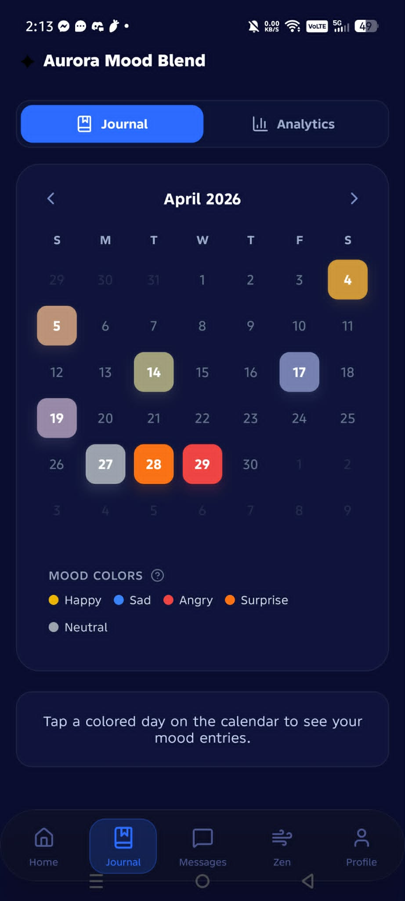
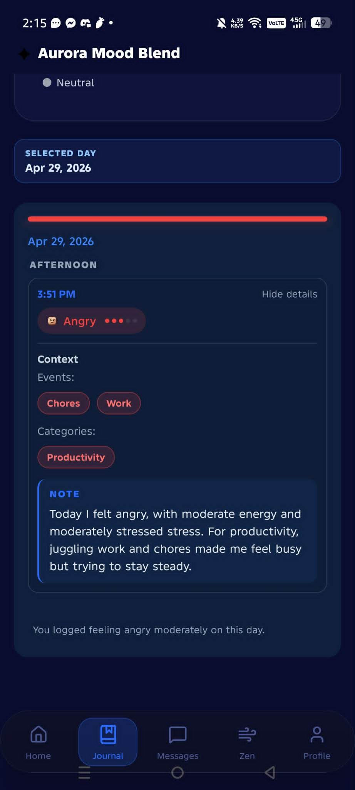
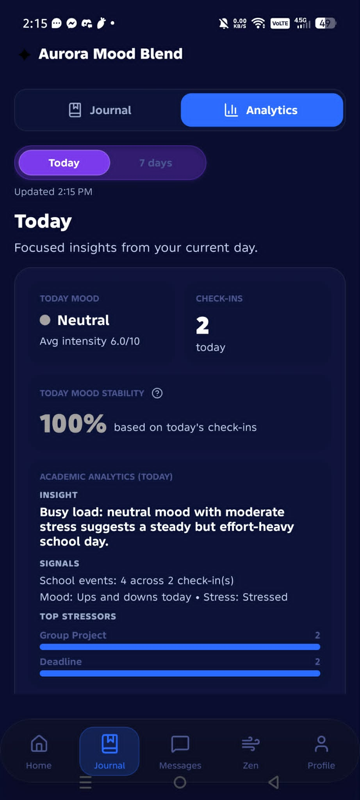
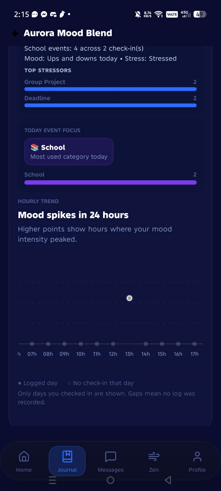
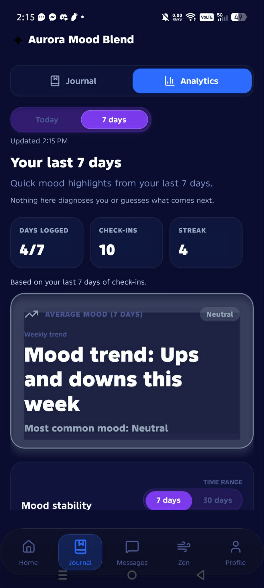
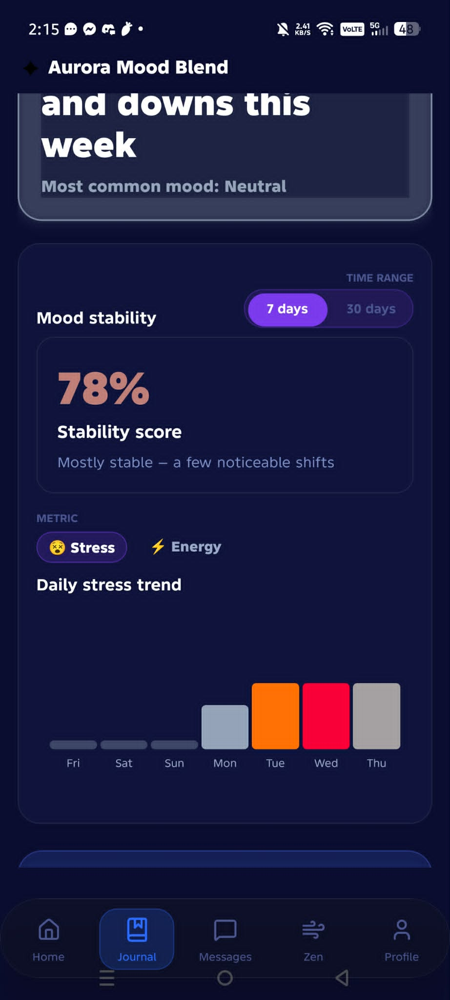
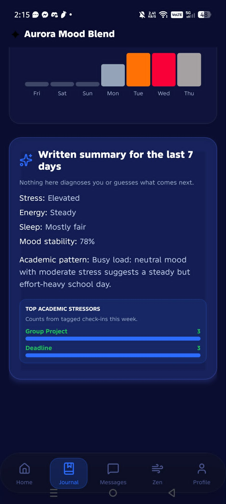

# Journal Feature (Mobile Version)

## Objective

This is a markdown file containing the information regarding the Journal Feature in the Mobile Version of Aurora. This file should be used as a reference to understand the feature and to implement it in the Web Version.

## Screens

In the Journal Section, there are Two Tabs:

- Journal
- Analytics

### 1. Journal Calendar

This section shows the Calendar with the default view being the current month and the current day being highlighted with a border-glow. There are arrows to browse through the months.

The days of the month in which the user has made a Mood Log entry are also highlighted in the color of the emotion that was logged that day. Tapping on a day will open the Mood Log Entry for that day below. There is also a legend depicting which colors represent which emotion.

### 2. Journal Mood Log Entry

Below the Calendar is the card for the Selected Day and the Mood Log Entries made on that day. At first, only the minimized version will be shown for each entry. Showing the time they took the entry, and the emotion for that entry. Tapping that entry will expand it, showing the full entry details such as its **Context**, **Events**, **Categories**, and **Journal Note**.

### 3. Analytics Today Overview

This section gives an Overview of the user's mood for the day. It shows the:

- Today mood along with the Average Intensity,
- Check-ins for the day
- Today Mood Stability
- Academic Analytics, showing the insights, signals, and events
- Today Event Focus

### 4. Analytics Today Graph

This section shows the mood graph for the day with the x-axis being the time and the y-axis being the mood intensity. The dot's color represent the emotion for that specific mood log entry.

### 5. Analytics 7 Days Overview

This is an overview of the user's mood for the past 7 days. It shows the current mood along with the Average Intensity,

- Days of the week the user has logged
- Total Check-ins during the week
- Streak
- Average Mood

### 6. Analytics 7 Mood Stability

This section shows a graph depicting the Mood Stability of the user, with tabs for **Stress** and **Energy**. It can also be expanded to _7 Days_ or _30 Days_.

### 7. Analytics 7 Days Summary

This section shows a summary of the user's mood for the past 7 days. It shows the:

- Stress Level
- Energy Level
- Sleep
- Mood Stability
- Academic Pattern
- Academic Stressors