# Round 5 Parity

## Objective

This is a markdown file containing the 5th Round of Parity which aims to bring the Web Version of Aurora to have the same exact features of the Mobile Version. This file should be used as a reference to understand the feature and to implement it in the Web Version.

## Screens

This section details the screens/pages/components that has been noted to be different from the Mobile Version. Listed below would be screenshots of the features of the Mobile version that are not in the Web Version.

### 1. Student Side

#### Student Dashboard (`/`)

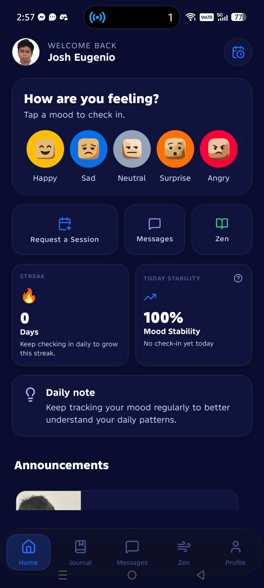

As can be seen from this screenshot, there are only minor differences in the UI of the Student Dashboard. Notably:
    
- There is a Calendar and Clock Icon at the Top-Right, on the same row as the Welcome message. Clicking this icon opens the **My Sessions** which shows the Sessions that the Student has to Counselors, may it be Future Sessions, Past Appointments, or Past & Closed Appointments. Along with a Button that would redirect the user to the Messages page (`/student/messages`).

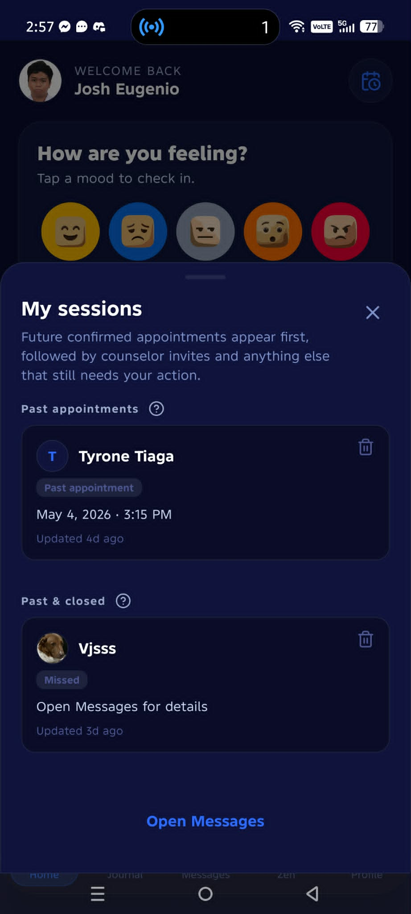

- There is also a **Question Mark Icon at the Today Stability Card**. Clicking this icon would cause a Modal to appear on the screen which explains what this statistic means.

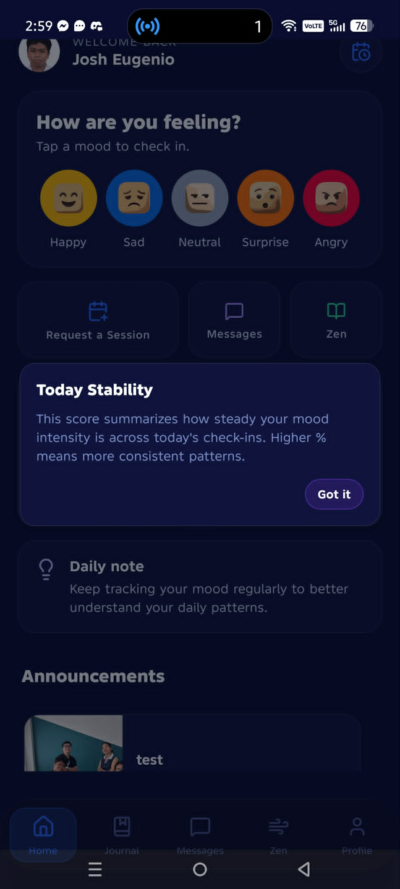

##### Mood Check-in

This is the section in which the Student logs their Mood Log Entries. There are some changes needed for this one. 

###### 1. Mood

- It's mostly similar with what we currently have in the current Web Version. However, some notable changes are:
    - The style in which the Steps are illustrated
    - Manual Check-in Option is on the Left, Daily Selfie Option is on the Right.
    - The SVGs are used for the mood icons.

    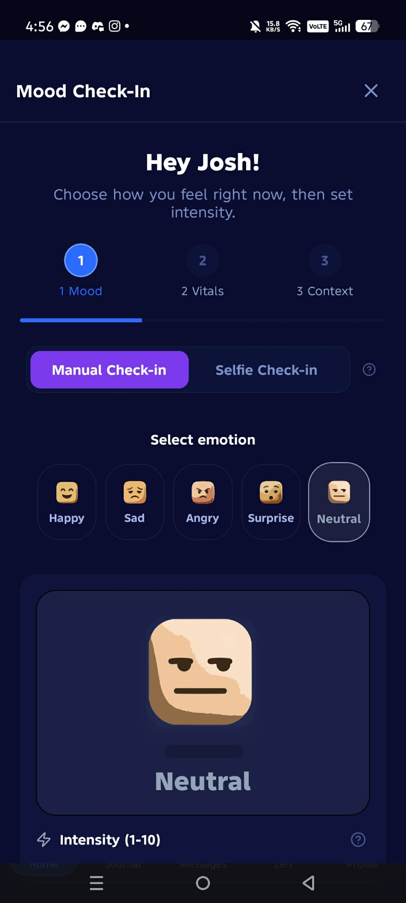

    - There is also a Hint Icon for the Manual Check-In

    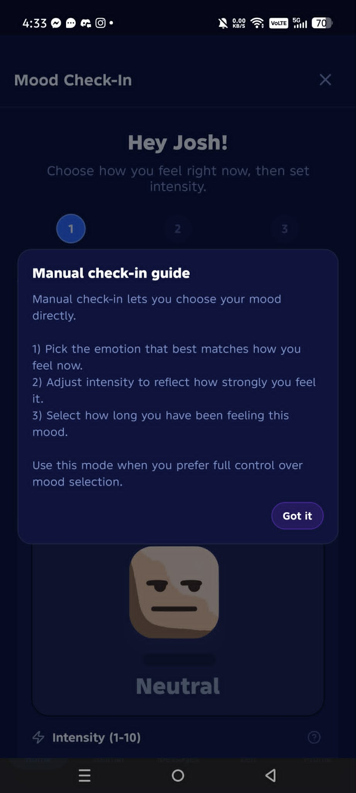

    - Aside from the Emotion to be selected, there is also:
        - a more obvious slider for Intensity of the Mood (and a Hint for it)
        - Duration of the Feeling with an input field

    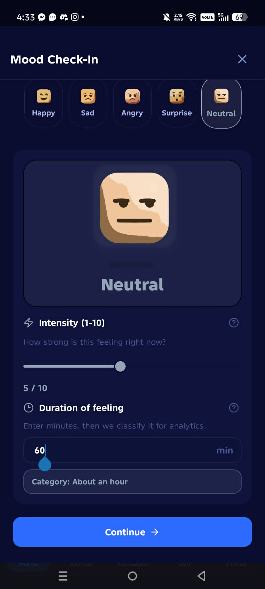

**IMPORTANT**: It would help a lot if, when after inputting the necessary data, or after taking the Daily Selfie, the data returned would be reflected on the Step 1 Screen, and can be seen again when the user chooses to go back to it later on.

Additionally, if the user uses the Daily Selfie option and the Detected Emotions are returned, the Continue button would be replaced with "Retake Photo" and "Use This Mood" buttons

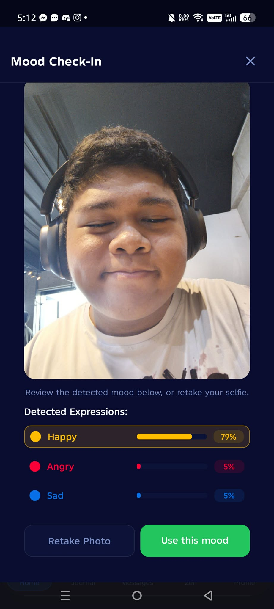

###### 2. Vitals

There should be:

- Slider for Energy Level
- Slider for Stress Level
- Options for Sleep Quality that would be **DISABLED** once a Sleep Quality log has been **made for the day**
- Meal Check-In
- Bath Check-In (Becomes **Disabled** once an Entry has been **made for the day** where it was marked as **Yes**)
- Hints for each Item

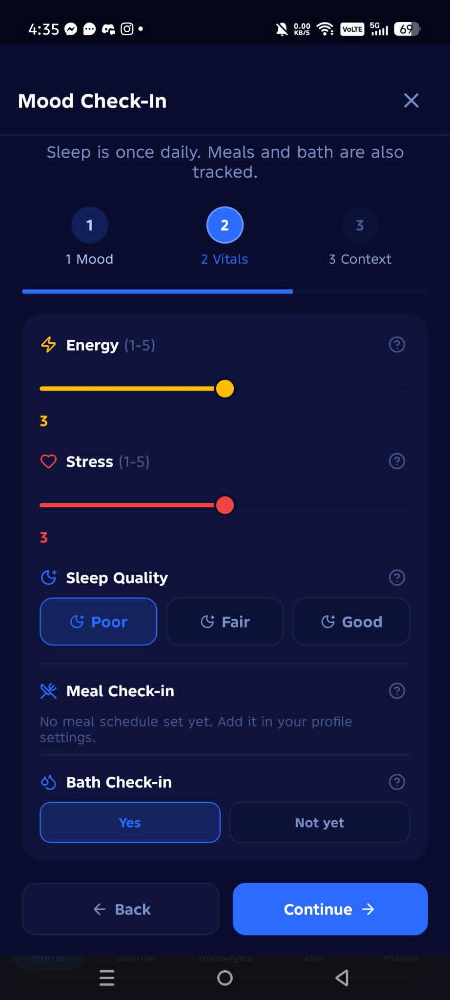

###### 3. Context

- A Pressure Chip that dynamically indicates how heavy the day is depending on the Context Chips the user selects.

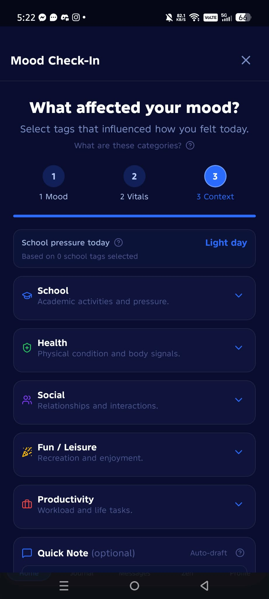

- For **EACH INDIVIDUAL** Pressure Chip selected, a unique text string would be added to the automated Journal Note.

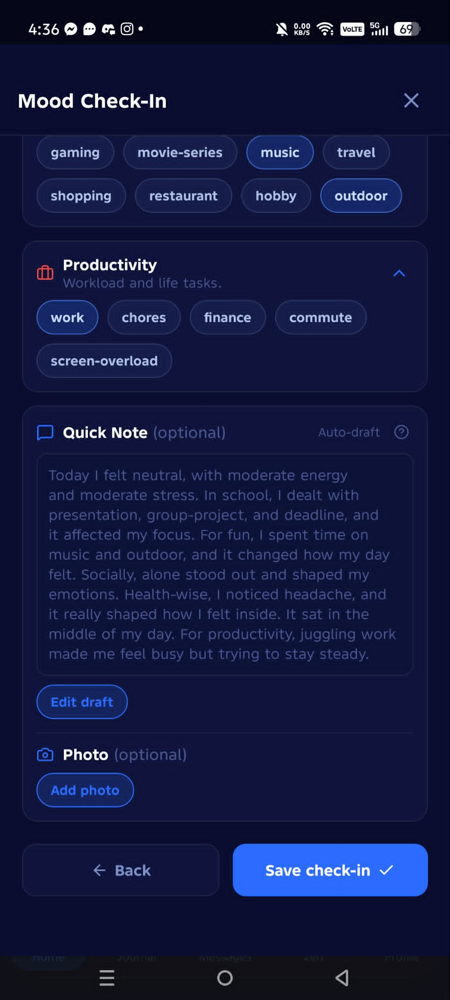

- An option to attach a Photo to that Entry should also be added

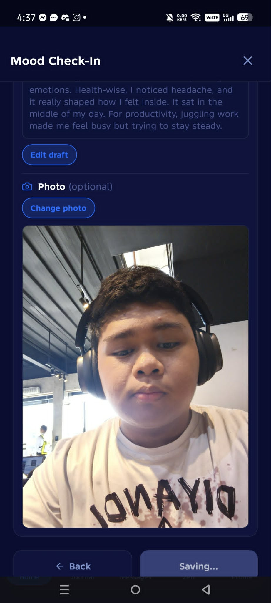

###### DONE

Once all steps are done, this should appear. With options to:
- Talk to a Counselor (which redirects to Messages)
- Quick Reset / Breathing Exercise for 60 seconds
    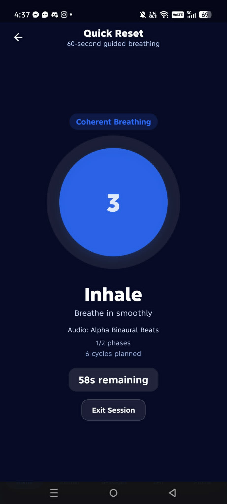
- Days Streak Chip
- Total Check-Ins for the Day Chip

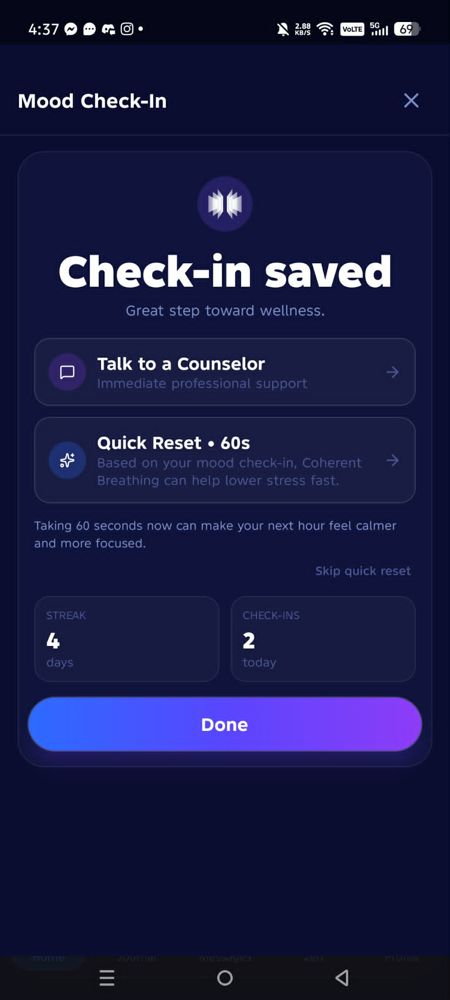

#### Student Journal (`/student/journal`)

This page should largely remain the same with a few key adjustments:

- Within the Journal Tab, under the Calendar, the details of selected Mood Log Entries should include:
    - Mood Duration
    - Energy & Stress Levels
    - Bath
    - Meal
    - Context
    - Journal Note
    - Photo
    - Academic Insight
    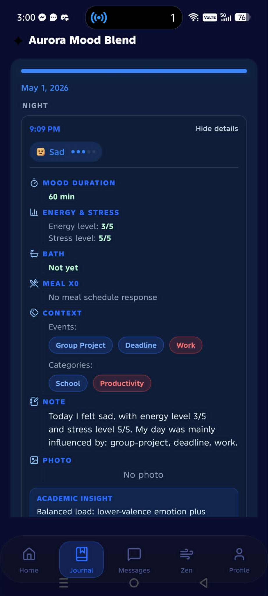
    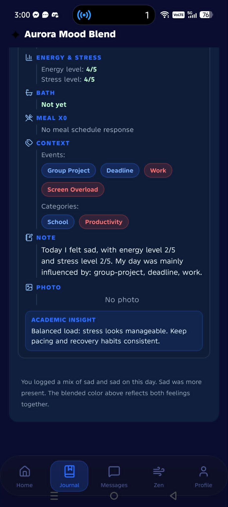

#### Student Resources (`/student/resources`)

This should be renamed to **Zen** and shows the following breathing exercises. See the image and mobile implementation for more information

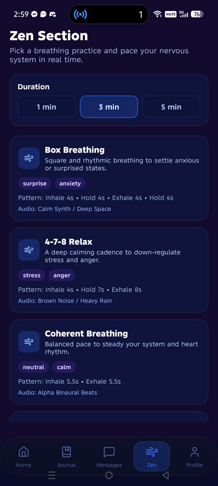

#### Student Profile (`/student/profile`)

There should be 4 Cards or Sections under this:

- Account Settings: 
    - Edit Profile (leads to a page that allows for Editing Account Details)
        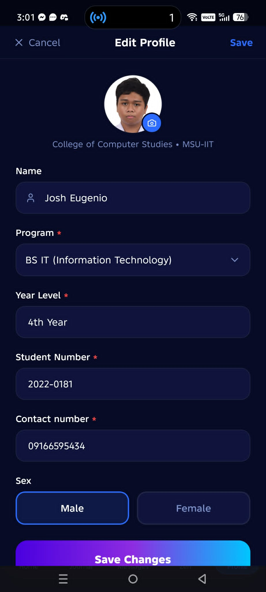
    - Meal Schedule
    - Bath Schedule
    - Wake-Up Schedule
- Personal Details:
    - Full Name
    - Sex
    - Department
    - Program
    - Year Level
    - Student Number
    - Contact Number
- Privacy Transparency
    - "What Counselors Can See" Dropdown
    - "What stays narrower until special population" Dropdown
- App Preferences
    - Session Updates Toggle
    - Daily Check-in Reminders Toggle
    - Reminder Time (default at 7 AM but can be changed)
- Then the Log out Button

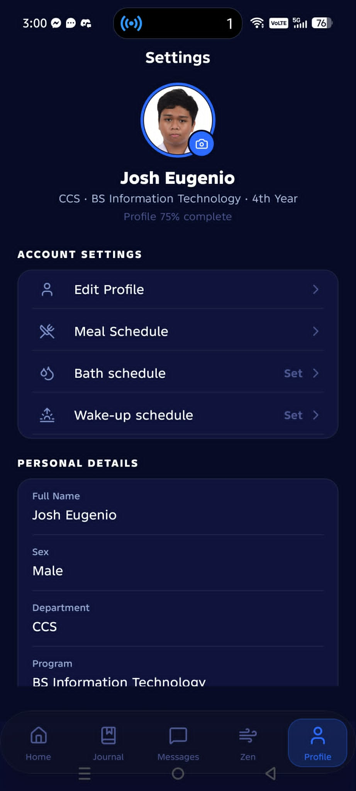
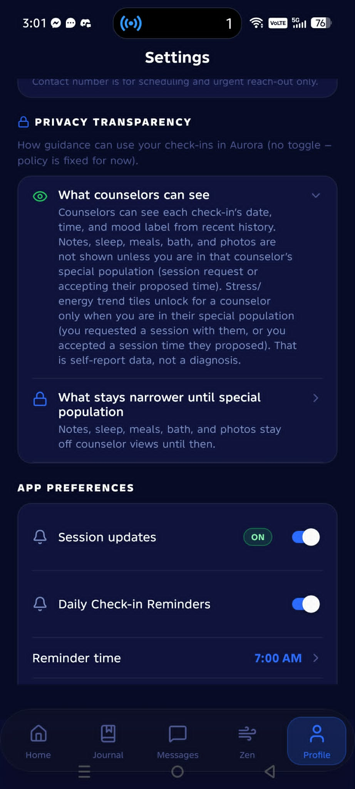

### 2. Counselor Side

#### Counselor Dashboard (`/`)

There should be 3 Sections:

- Dashboard Overview:
    - Chip for Total Students
    - Chip for Upcoming Accepted Sessions
- Students
    - Shows chips for each student
- Announcements (with an option to Add an Announcement)

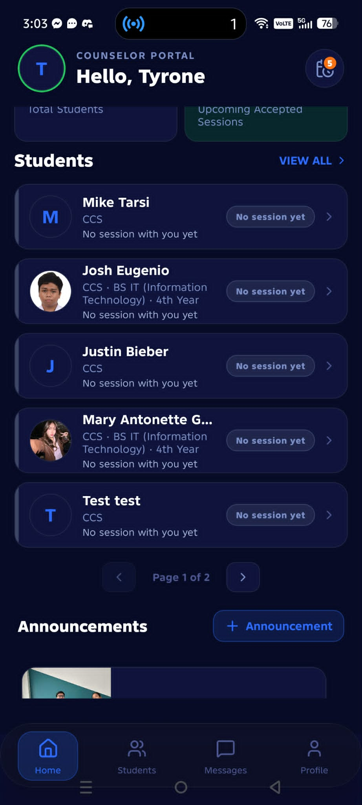

- Additionally, There is a Calendar and Clock Icon at the Top-Right, on the same row as the Welcome message. Clicking this icon opens the **Sessions Pane** which shows the Sessions that the Counselor has. It has chips separated by *Pending Requests*, *Expired ones*, and more. (Refer to the mobile implementation).
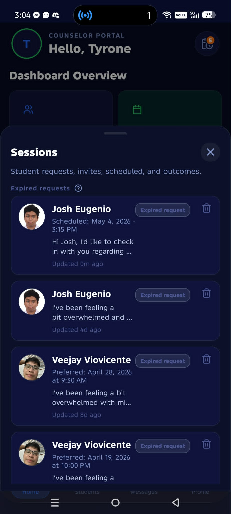

- Clicking any of the chips would bring the user to the **Session History** page where all the Counselor's sessions are detailed.
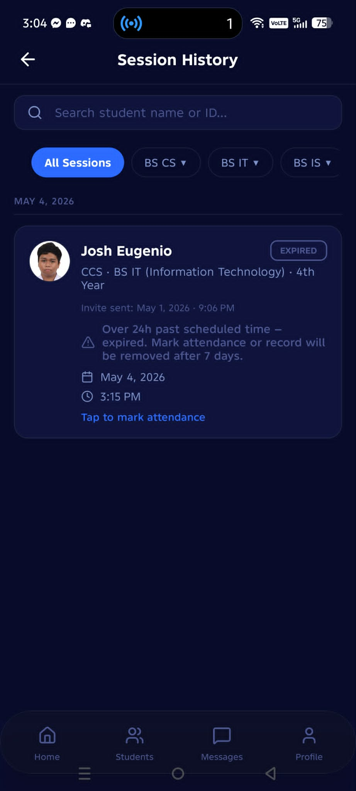
    - Clicking one of the chips in the Session History would show a panel showing the details of that specific session:
        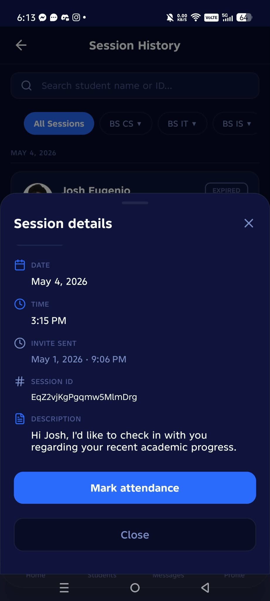
        - Student (Avatar, Full Name, Department, Program, Year Level)
        - Date of Session
        - Time of Session
        - Date and Time the Invite was Sent
        - Session ID
        - Description
        - Button to Mark Attendance (Clicking this button would show this)
            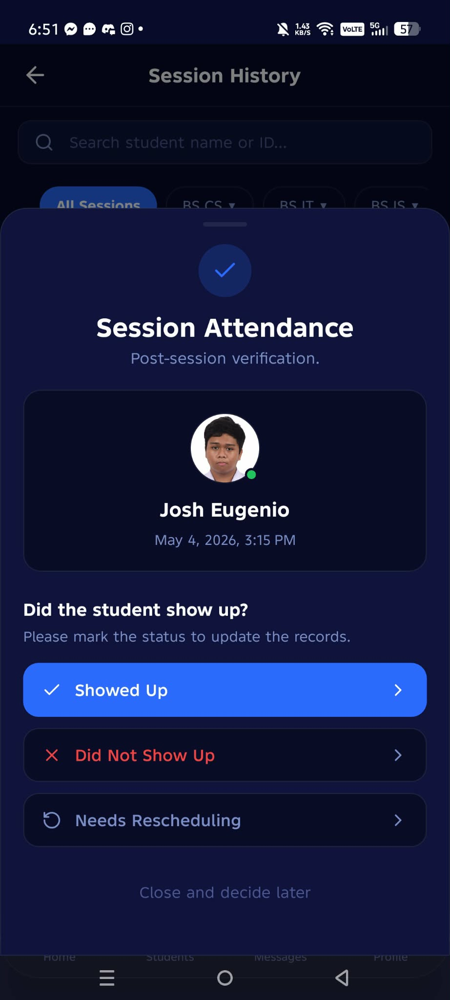

#### Counselor Students (`/counselor/students/`)

This page shows the Students recorded in the Database, with Chips for each Student and a Search and Filter option

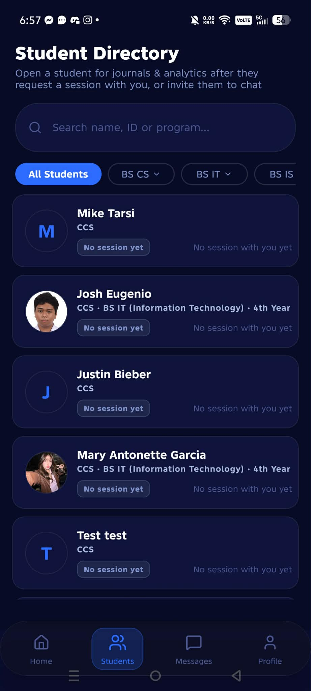

- Clicking any of the Student Chips opens the **Student Profile** page (`/counselor/students/:id`), which contains:
    - Student's Full Name
    - Department
    - Program
    - Year Level
    - Email
    - Contact Number
    - Button to Invite Session (which redirects to Messages (`/counselor/messages/`) when pressed)
    - Calendar with Entries
    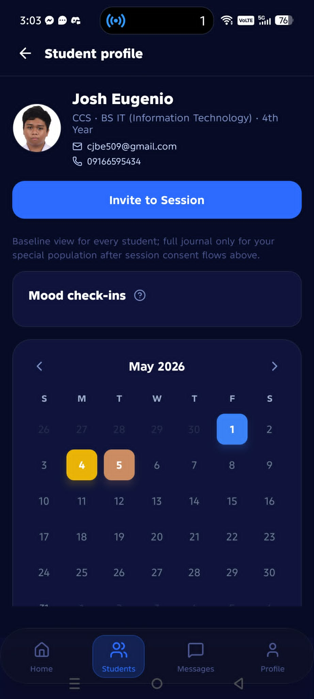
    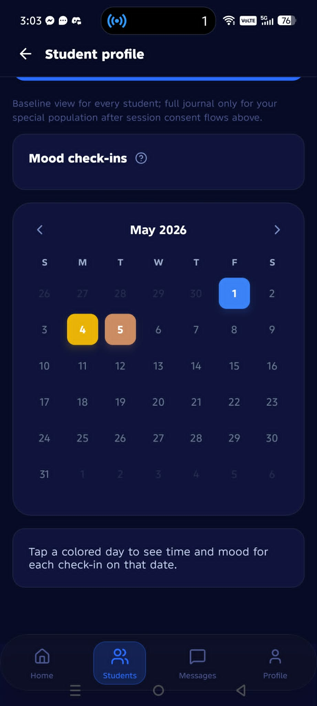
    - Another Card below the Calendar which shows the Mood Log Entries for the selected Day
    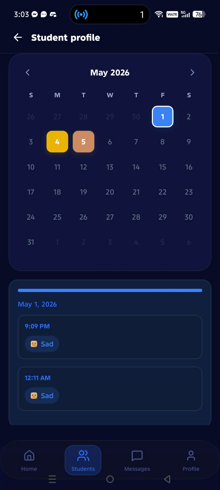

**IMPORTANT**: Counselors can see **ONLY** the Mood logged for that entry by default. However, when a student is marked as *Special Population* (by having a Scheduled Session with a Counselor), then the student's Journal Notes and Context would be visible to that specific Counselor.

#### Counselor Messages (`/counselor/messages`)

This section shows the Direct Messages that the Counselor have with the Students.

// TODO: PUT DEFAULT MESSAGE SCREEN

##### Counselor Messages DMs

Remains largely the same with the current implemented Web Version, 