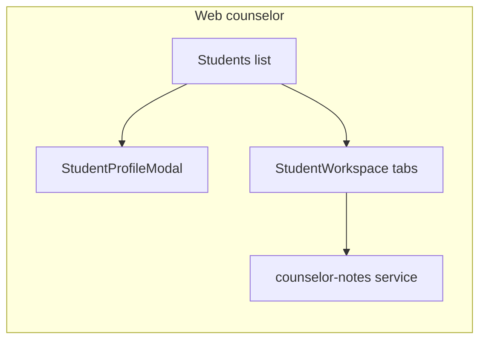

# Mobile → Web parity (next round)

## Context from workflows

- **[web-refactor.md](.agent/workflows/web-refactor.md):** Keep Vite + React 19, `react-router-dom` v7, Tailwind v4 + tokens in [src/index.css](src/index.css), Context (not Zustand), `lucide-react`, Firebase. New services: `src/services/{feature}/{verb}/…` + barrel `index.ts`.
- **[aurora-design-system.md](.agent/workflows/aurora-design-system.md):** Dark AURORA parity (`bg-aurora-bg`, `bg-aurora-card`, borders, pills, modals). Web-only layout changes (sidebar, wider grids, centered dialogs) are OK.
- **[mobile-feature-parity.md](.agent/workflows/mobile-feature-parity.md):** Phases A–D and E1–E7 + F1–F6 are marked done in Section 4–5; treat **Round 3** as new gaps not yet written there.
- **Round 3 tracker:** Use a dedicated log file at **[round-3-progress.md](.agent/workflows/round-3-progress.md)** for all progress updates in this implementation pass. Do not modify the legacy Round 1/2 log unless explicitly requested.

## Current code structure (for Round 3 implementation)

- **App shell**
  - `src/App.tsx` handles role-based routing and wraps providers (`AuthProvider`, `UserDaySettingsProvider`).
  - Layouts split by role:
    - `src/layouts/StudentLayout.tsx`
    - `src/layouts/CounselorLayout.tsx`
    - `src/layouts/AdminLayout.tsx`
- **Pages**
  - Student pages: `src/pages/student/`
  - Counselor pages: `src/pages/counselor/`
  - Admin pages: `src/pages/admin/`
  - Shared role dashboards at `src/pages/StudentDashboard.tsx` and `src/pages/CounselorDashboard.tsx`
- **State / context**
  - Auth and identity: `src/contexts/AuthContext.tsx`
  - Student day settings: `src/contexts/UserDaySettingsContext.tsx`
- **Shared domain types**
  - `src/types/*.types.ts` (examples: `user.types.ts`, `session.types.ts`, `announcement.types.ts`, `user-settings.types.ts`)

### `src/services/` structure (important)

- **Pattern used across most domains**
  - `src/services/{domain}/get/*.ts`
  - `src/services/{domain}/post/*.ts`
  - `src/services/{domain}/put/*.ts`
  - `src/services/{domain}/delete/*.ts`
  - `src/services/{domain}/index.ts` exporting one service object
- **Main service domains already present**
  - `messages/` — conversations and chat message operations
  - `sessions/` — request/invite/confirm/status session lifecycle
  - `counselor/` — students, session history, access control actions
  - `announcements/` — list/subscribe/create/update/delete + image upload
  - `audit-logs/` — read and write audit entries
  - `presence/` — RTDB online presence status
  - `mood/` — mood reads/writes and day-key checks
  - `user-settings/` — student settings doc access
  - `schedule/`, `notification/`, `admin/`, `zen-sounds/`
- **Firebase adapters already in-place**
  - `src/services/firebase-auth/` for auth + user profile actions
  - `src/services/firebase-firestore/` as lower-level Firestore helper layer
- **Round 3 convention to follow**
  - New domains (for example `resources/` and `counselor-notes/`) must follow the same verb-folder + `index.ts` service-object structure.
  - Keep one function per file and import via the domain `index.ts`.

## Verified web gaps (this repo)

| Area | Evidence |
|------|------------|
| **Counselor per-student route** | [App.tsx](src/App.tsx) has `/counselor/students` only — no `/counselor/students/:id`. Mobile glob lists `app/(counselor)/students/[id]/index.tsx`, `messages.tsx`, `notes.tsx` and `CounselorStudentDetailScreen.tsx`. |
| **Counselor notes** | No matches for `counselor_notes` / `counselorNotes` under [src/](src/). |
| **Session UX depth** | Mobile-side components exist by name (`SessionHistoryDetailModal`, `SessionAttendanceModal`, `SessionNoteForm`). Web [SessionHistory.tsx](src/pages/counselor/SessionHistory.tsx) is list + filters + [SessionCard](src/components/sessions/SessionCard.tsx) only. |
| **Student resources data** | [Resources.tsx](src/pages/student/Resources.tsx) uses `MOOCK_RESOURCES`; there is **no** [src/services/resources/](src/services/resources/) tree (workflow still lists porting `resources.service.ts`). |
| **Admin school analytics** | [AdminAnalytics.tsx](src/pages/admin/Analytics.tsx) uses static stat tiles (`1,248`, etc.). Mobile has `SchoolMoodChart`, `ThresholdConfigCard` — likely richer or data-backed. |

## Recommended implementation order

### 1) Counselor student workspace (highest user value)

**Goal:** Match mobile’s counselor ability to work a single student beyond the existing [StudentProfileModal](src/components/counselor/StudentProfileModal.tsx) (summary + “open chat”).

- Add route **`/counselor/students/:studentId`** in [App.tsx](src/App.tsx) and a page e.g. `src/pages/counselor/StudentWorkspace.tsx` (or `StudentDetail.tsx`) with a **tabbed layout** aligned to mobile: **Overview** (reuse signal + check-in summary logic already used in modal/list), **Messages** (deep-link to existing chat: create/find conversation + `navigate` to `/counselor/messages` with state or query param), **Notes** (new).
- **Notes:** Port types + Firestore access from mobile `counselor-notes` / `counselor_notes` usage into `src/services/counselor-notes/` (verb folders + barrel), thin `useCounselorNotes` hook, list + add/edit UI per Aurora form patterns ([aurora-design-system.md](.agent/workflows/aurora-design-system.md) §6).
- **Optional parity slices** (if mobile screens justify them): embed read-only **journal calendar** / **last 7 days charts** — mirror [CounselorStudentJournalCalendar](file in mobile repo) / [CounselorStudentLast7Charts](file in mobile repo) once those files are read for exact fields and queries.

**Design note:** [Students.tsx](src/pages/counselor/Students.tsx) rows use `text-aurora-primary-dark` on `card-aurora`; for strict dark parity with mobile counselor surfaces, align typography with `text-white` / `text-aurora-text-sec` on the same tokens as the dashboard (quick pass when touching this file).

### 2) Session history: detail, attendance, notes

**Goal:** Close the gap vs. mobile’s post-session flows.

- From mobile reference files, define minimal UX: **detail drawer/modal** from [SessionHistory.tsx](src/pages/counselor/SessionHistory.tsx) row → show full session doc + student snippet.
- Wire **attendance / status updates** through existing [sessionsService](src/services/sessions/index.ts) (`updateSessionStatus` / related) — extend only if mobile stores extra fields.
- **Session notes:** If mobile writes a separate subcollection or fields on `sessions`, add matching `src/services/sessions/` functions (one function per file) and UI in the detail modal.

### 3) Student Resources: Firestore + Storage parity

**Goal:** Replace `MOCK_RESOURCES` with the same data model mobile uses.

- Add `src/services/resources/` (get/list, optional admin CRUD if shared with admin Resources page).
- Refactor [Resources.tsx](src/pages/student/Resources.tsx) + [ResourceCard](src/components/student/ResourceCard.tsx) to consume real documents; keep [BreathingExercise](src/components/student/BreathingExercise.tsx) / zen audio patterns already on web.
- Ensure admin [Resources](src/pages/admin/Resources.tsx) and student view stay consistent (same types in [src/types/](src/types/)).

### 4) Admin analytics + thresholds (medium)

**Goal:** Replace placeholder numbers where mobile already graphs or configures thresholds.

- Read mobile `SchoolMoodChart.tsx` and `ThresholdConfigCard.tsx` to learn Firestore paths and aggregates.
- Option A: **Wire real aggregates** (mood logs / users counts) into [AdminAnalytics.tsx](src/pages/admin/Analytics.tsx). Option B: If backend aggregation is missing, add **documented** Cloud Function or client query with performance caveats — match mobile’s approach first.
- Add admin UI for **threshold config** only if mobile persists it to Firestore (avoid speculative schema).

### 5) Explicit non-goals (unless you expand scope)

- **Push notifications:** Mobile `push-notifications.service.ts` does not map 1:1 to web; defer or use FCM web separately.
- **SwipeableTabs / native-only polish:** Low priority; use tabs + responsive layout on web.

## Process checklist (per feature)

Use the per-page checklist in [web-refactor.md §5](.agent/workflows/web-refactor.md) and branding tokens in [mobile-feature-parity.md §0](.agent/workflows/mobile-feature-parity.md).

## Doc maintenance

After implementation, update only [round-3-progress.md](.agent/workflows/round-3-progress.md): status per todo, files touched, and blockers/next steps for handoff.
